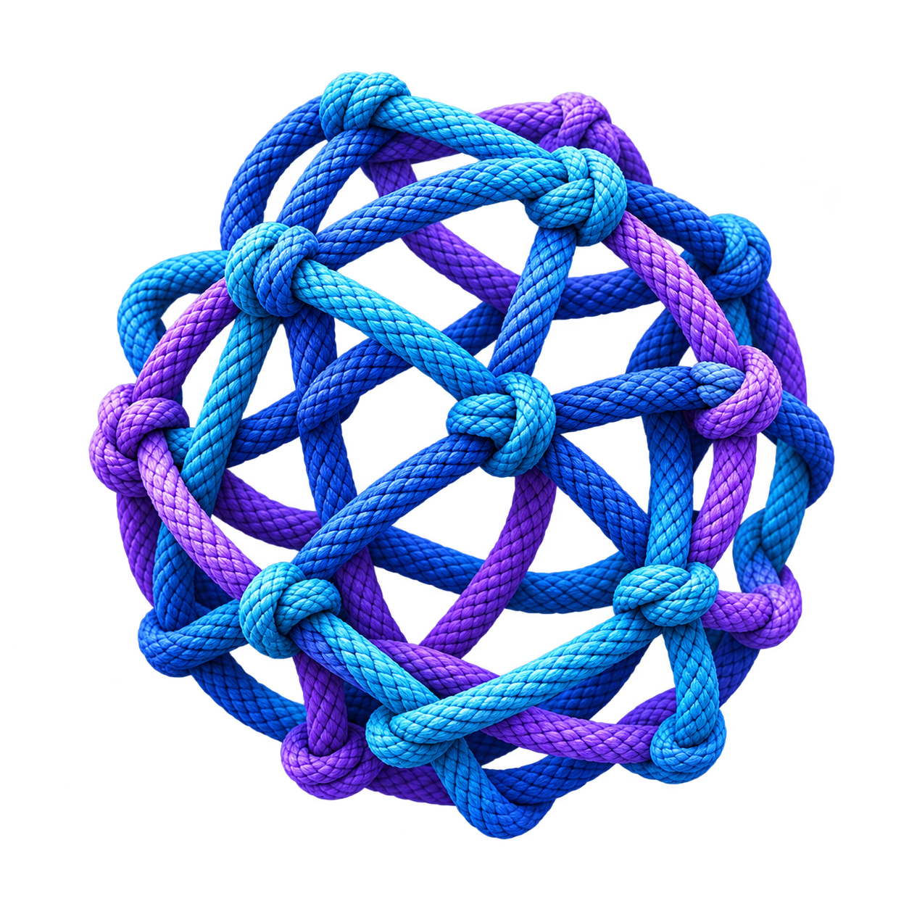

<p align="center">
   
</p>

# Knot

Knot is a desktop app for running and tying together multiple AI coding agents. Each agent gets its own terminal session, workspace, status, and MCP connection.

This repository is moving Knot from its original Swift/macOS implementation to a cross-platform Rust application built with [GPUI-Kit](https://github.com/longbridge/gpui-kit). The Swift app remains in the repository as the behavioral reference while the Rust port is developed crate by crate.


[](https://tooomm.github.io/github-release-stats/?username=pilgrimagesoftware&repository=Knot)

## Current State

The Rust application currently provides a GPUI shell with workspace and agent management, PTY-backed terminal sessions, agent activity tracking, MCP messaging, agent hooks, persisted settings, repository discovery, and Git operations.

The port is in progress. The Rust UI and backend are usable for the implemented slices, while several features from the Swift app are still being ported.

## Features

- Run multiple AI coding agents in separate terminal sessions.
- Create, rename, select, close, restart, and reattach agents and workspaces.
- Track working, idle, awaiting-input, and error states.
- Coordinate agents through a local MCP server and agent-to-agent messaging.
- Persist agents, workspaces, personas, and settings.
- Discover repositories and linked Git worktrees.
- Parse Git status, diffs, and change statistics.
- Support Claude Code, Codex, Gemini CLI, GitHub Copilot, OpenCode, shell agents, and custom commands through the launch configuration.

## Repository Layout

- `crates/knot/` - GPUI-Kit desktop application and shell UI.
- `crates/knot-core/` - Settings, persisted records, localization, and shared types.
- `crates/knot-agents/` - Agent state and workspace management.
- `crates/knot-terminal/` - PTY sessions and terminal activity integration.
- `crates/knot-activity/` - Activity detection and idle tracking.
- `crates/knot-mcp/` - Local MCP HTTP server and hook routes.
- `crates/knot-mcp-tools/` - MCP tool catalog.
- `crates/knot-messaging/` - Agent-to-agent message routing and unread state.
- `crates/knot-discovery/` - Repository and worktree discovery.
- `crates/knot-git/` - Runtime-agnostic Git operations and parsers.
- `crates/knot-history/` - Conversation history providers and cache.
- `crates/knot-watch/` - Debounced filesystem watching.
- `Skwad/` and `SkwadTests/` - Original Swift/macOS implementation and behavioral reference.
- `openspec/` - Contracts and implementation changes for the Rust port.

## Requirements

- Rust 1.98 or newer, using the toolchain in `rust-toolchain.toml`.
- A supported desktop environment for GPUI-Kit. CI currently builds on macOS and Ubuntu.
- An AI coding CLI such as [Claude Code](https://github.com/anthropics/claude-code), Codex, Gemini CLI, GitHub Copilot, or OpenCode.
- Git 2.30 or newer for Git and worktree tests.

## Build And Test

```bash
git clone https://github.com/pilgrimagesoftware/Knot.git
cd knot-rust

# Run formatting, linting, tests, and the workspace build.
make rust

# Run individual checks.
make rust-fmt
make rust-lint
make rust-test
make rust-build
```

To run the Rust desktop application directly:

```bash
cargo run -p knot
```

The Swift reference app has separate Xcode and Makefile targets. Those targets are not required for Rust port development.

## Architecture

The Rust workspace keeps the UI, terminal runtime, MCP server, messaging, discovery, Git, and persistence concerns in separate crates. Contracts under `openspec/specs/` define the behavior being ported from Swift.

See [AGENTS.md](AGENTS.md) for development conventions and crate dependencies.

## License

AGPL-3.0, see [LICENSE](LICENSE) for details.

Copyright &copy; 2026 Kochava Studios
